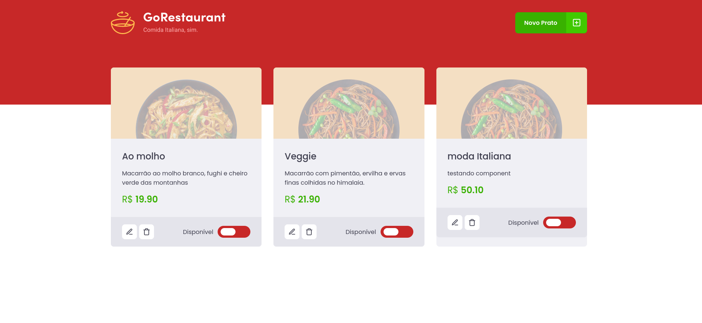
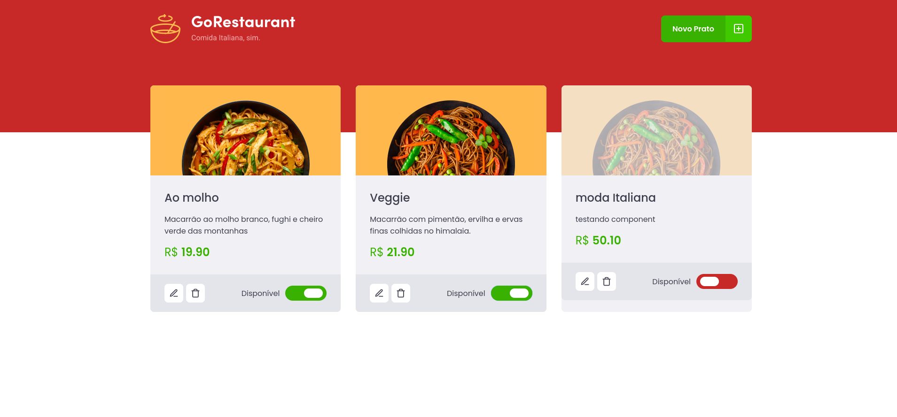
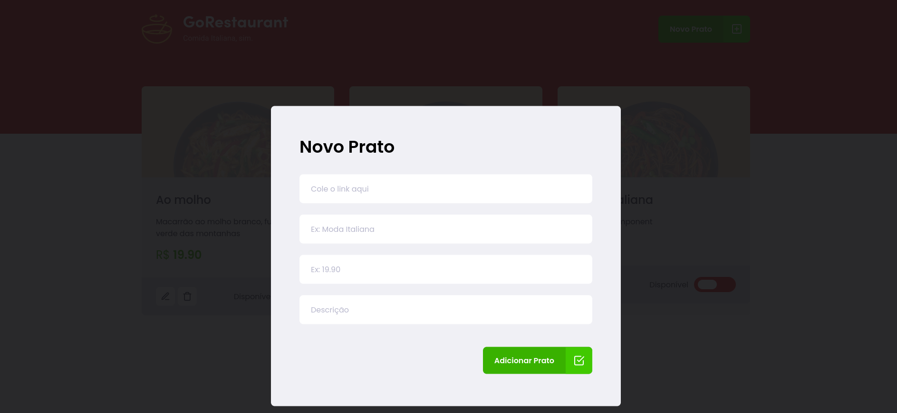

# Ignite-Refactoring-de-classes-e-typescript
## Nesse desafio, você deverá criar uma aplicação para treinar o que aprendeu até agora no ReactJS

# Sobre o desafio
### Essa será uma aplicação já funcional onde o seu principal objetivo é realizar dois processos de migração: de Javascript para Typescript e de Class Components para Function Components.

 
